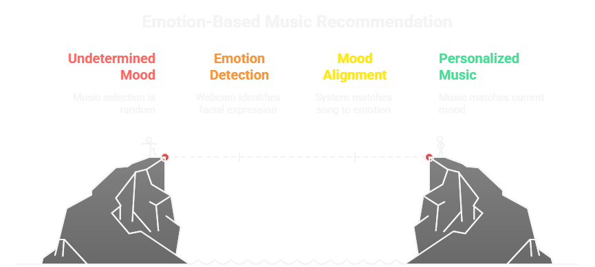

<h1 align="center">Emotion-Based Music Recommendation</h1>

<p align="center">
  
  
  
  
</p>

<p align="center">
  A real-time emotion-based music recommendation system that detects your facial emotion and suggests a song that matches your mood.
</p>

<p align="center">
  
</p>

## 🎵 How it Works

The application uses a machine learning model to classify your emotion from a live video stream. Here's a breakdown of the process:

1.  **Face Detection**: It captures video from your webcam and uses a face mesh to identify facial landmarks.
2.  **Emotion Recognition**: The facial landmarks are fed into a pre-trained machine learning model to predict your emotion (e.g., happy, sad, angry).
3.  **Song Recommendation**: Based on the detected emotion, the application selects a random song from a curated list and plays it using an embedded YouTube player.

## ✨ Features

*   **Real-time Emotion Detection**: Instantly detects your emotion from your webcam feed.
*   **Dynamic Music Recommendations**: Suggests music that aligns with your current mood.
*   **Interactive Web Interface**: A user-friendly interface to view the video feed, detected emotion, and control music playback.
*   **YouTube Integration**: Seamlessly embeds and plays recommended songs from YouTube.

## 🚀 Technology Stack

*   **Backend**: Flask (Python)
*   **Frontend**: HTML, CSS, JavaScript
*   **Machine Learning**: Scikit-learn, ONNX Runtime, MediaPipe
*   **Libraries**: OpenCV, NumPy, Pandas

## 🛠️ Getting Started

### Prerequisites

*   Python 3.7+
*   A webcam

### Installation

1.  **Clone the repository:**
    ```bash
    git clone https://github.com/your-username/Emotion-based-music-recommendation.git
    cd Emotion-based-music-recommendation
    ```

2.  **Create a virtual environment and activate it:**
    ```bash
    python -m venv venv
    venv\Scripts\activate  # On Windows
    # source venv/bin/activate  # On macOS/Linux
    ```

3.  **Install the required dependencies:**
    ```bash
    pip install -r requirements.txt
    ```

### Usage

1.  **Run the application:**
    ```bash
    python app.py
    ```

2.  **Open your web browser** and navigate to `http://127.0.0.1:5000`.

3.  **Allow the browser to access your webcam.** The application will start detecting your emotion and recommend a song.

## 📄 License

This project is licensed under the MIT License - see the [LICENSE](LICENSE) file for details.